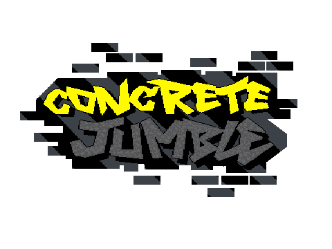
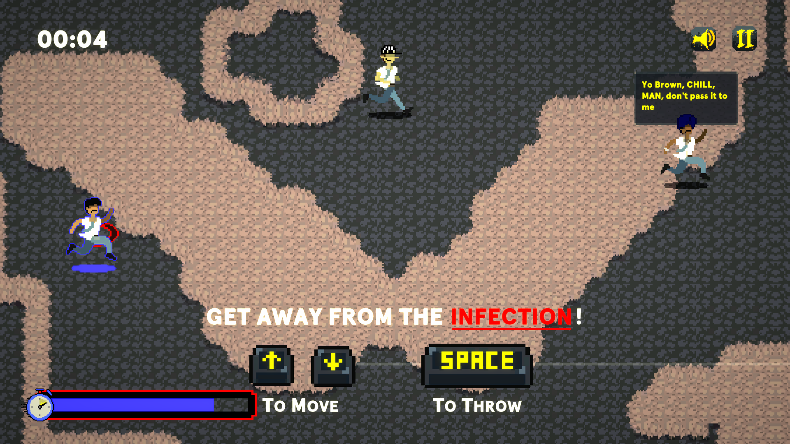
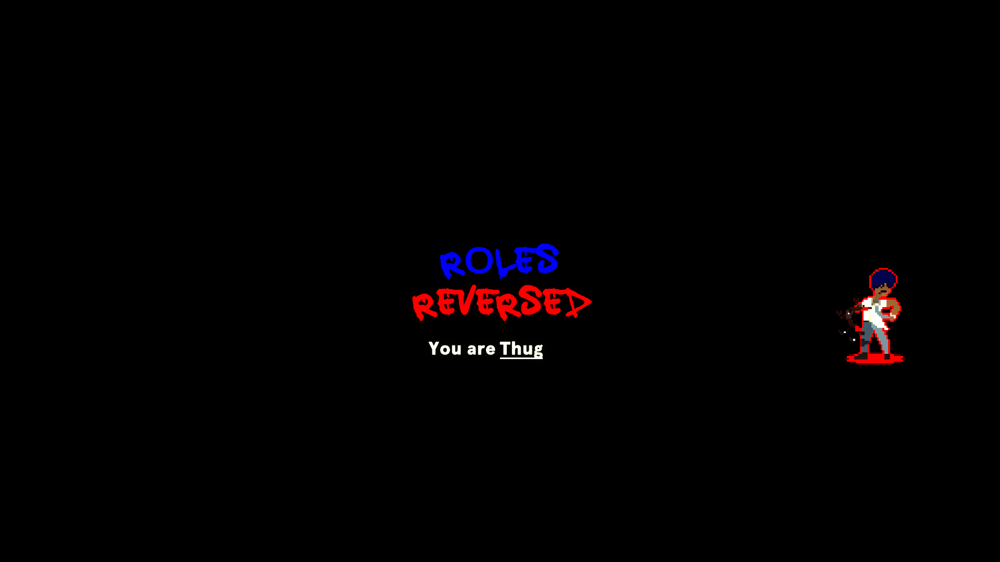
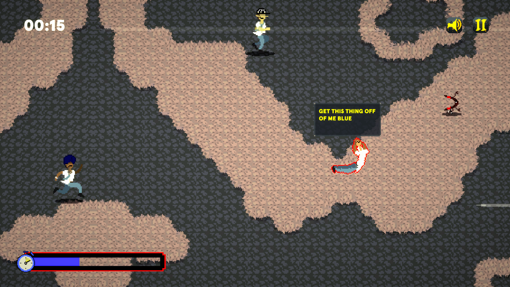
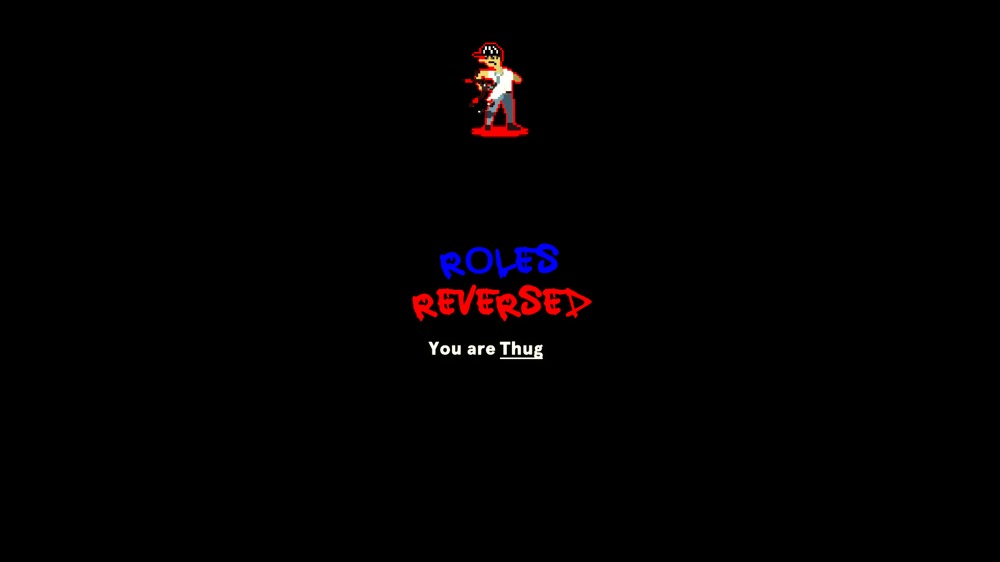
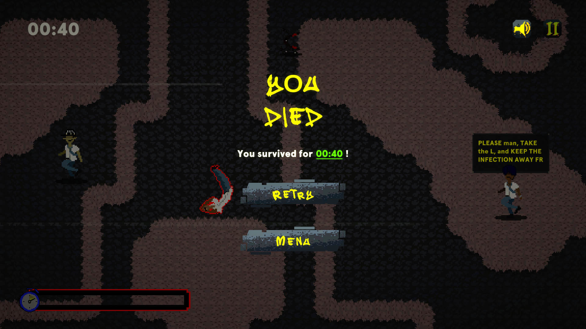

# Concrete Jumble
  This game was made as a submission to the GMTK Game Jam 2023.
   
  <a href='https://www.youtube.com/watch?v=oxdO2_ccgTQ'>Trailer</a>
   
  <a href='https://stashatstake.itch.io/concrete-jumble'>Link to play</a>
  
   
   

  
  

      Concrete Jumble is a top-down chaotic and goofy game about a street fight between a couple thugs.
      The hotheads are fighting as usual, with a green onlooker. Mr. Green guy has a weird glowing boomerang. He says it carries "boomerangiasis".
      And everyone starts running.
  

  
  
  
  <h1> Gallery </h1>
    
   
  

  
  
  

  
  
  

  
  
  

  
  
  

  

  
  
  <h1> Prerequisites </h1>
  <ul>
      <li>
        <a href='https://unity.com/releases/editor/whats-new/2021.3.10'> Unity Engine ver 2021.3.10f1 </a>
      </li>
  </ul>   
   
  <h1> Co-author </h1>
  

      <a href='https://github.com/RobinTheHoo'> RobinTheHoo </a>
  

